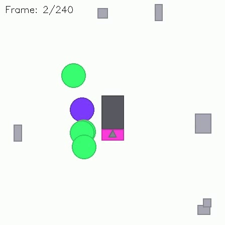

<div align="center">

# ATARIBench: Assess Temporal Abstract Perception and Reasoning of Symbolic Interaction with LLMs

**Karam Tomotaki-Dawoud**<sup>1</sup> · **Alexander Ehrenhoefer**<sup>1,2</sup> · **Katerina Katsarou**<sup>1</sup> · **Sebastian Bosse**<sup>1</sup>

<sup>1</sup>Fraunhofer HHI, Berlin, Germany &nbsp;&nbsp; <sup>2</sup>TU Berlin, Germany

**ACCV 2026**

[Paper (coming soon)](#) · [Citation](#citation)



*An example ATARIBench scene. Colour-coded actors move on a 16×16 grid, each carrying a symbolic instrument, and may hand an instrument over to another actor. No single frame shows the handover. The model has to follow the actors across frames to tell whether a transfer happened, in which direction, and at which frame.*

</div>

---

> [!NOTE]
> **Code coming soon.** The procedural scene generator, the evaluation protocol and the scripts that reproduce the paper's results will be released here in time for **ACCV 2026**. Watch or star the repository to be notified.

## Abstract

Whether large language models reason about structured content or pattern-match memorised data remains contested. Existing benchmarks probe abstract visual reasoning on static puzzles, temporal reasoning on linguistic event sequences, or recognition of single ASCII-art frames; none asks whether a model can perceive how an abstract scene evolves over time. We introduce **ATARIBench**, a diagnostic benchmark for multi-actor interaction detection in content-free, top-down scenes: colour-coded actors move on a grid, carry symbolic instruments and may hand one over—an event that no single frame reveals. Every scene is rendered from one world state as an RGB image sequence and as an ASCII grid sequence, and the benchmark is released as a procedural generator to resist training-set contamination. A decoupled protocol—direct detection, a perceive-then-reason chain, and an oracle that supplies ground-truth perception—separates perception from reasoning errors, and detections are scored at clip level, within ±1 frame and at the exact frame. Evaluating four open 9–14B models and two frontier models (GPT-4o, Claude Sonnet 4.6), we find that (i) the preferred modality is model-dependent; (ii) direct reasoning beats a perceive-then-reason chain unless the intermediate description is reliable; (iii) perception, not reasoning, is the dominant bottleneck, which frontier models narrow but do not remove; (iv) detecting a transfer is far easier than naming its direction or pinpointing its frame; and (v) intermediate horizons are best. With oracle scores near 0.8, the benchmark remains unsaturated.

## Planned release

- **Procedural generator.** Produces new scenes with controllable difficulty. We release the generator instead of a fixed dataset so that new instances can always be drawn, which guards against training-set contamination.
- **Dual-modality rendering.** Each scene is rendered from the same world state as an RGB image sequence (`img`) and as an ASCII grid sequence (`ascii`).
- **Decoupled evaluation protocol.** Three settings: direct detection, a perceive-then-reason chain, and an oracle that supplies ground-truth perception.
- **Scoring.** Detections are scored at clip level, within ±1 frame, and at the exact frame.
- **Reproduction scripts.** Prompts and evaluation code for the open and frontier models reported in the paper.

## Citation

If you find ATARIBench useful, please cite:

```bibtex
@inproceedings{tomotakidawoud2026ataribench,
  title     = {{ATARIBench}: Assess Temporal Abstract Perception and Reasoning of Symbolic Interaction with {LLMs}},
  author    = {Tomotaki-Dawoud, Karam and Ehrenhoefer, Alexander and Katsarou, Katerina and Bosse, Sebastian},
  booktitle = {Proceedings of the Asian Conference on Computer Vision (ACCV)},
  year      = {2026}
}
```

## Contact

For questions, please open an issue or contact the authors at `firstname.lastname@hhi.fraunhofer.de`.
